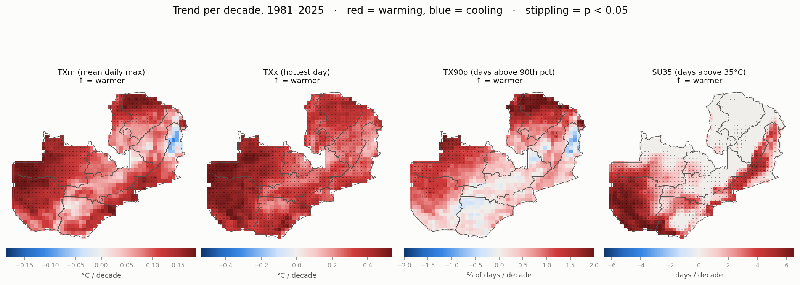
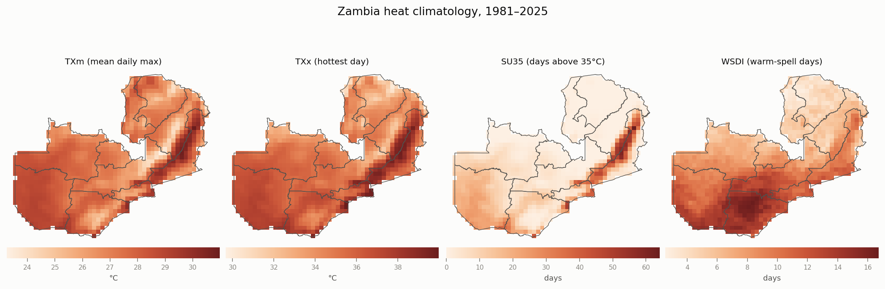
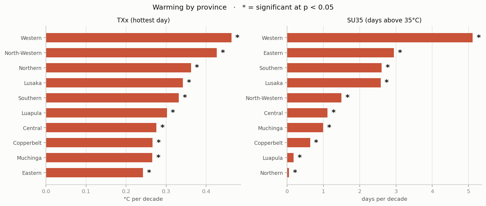
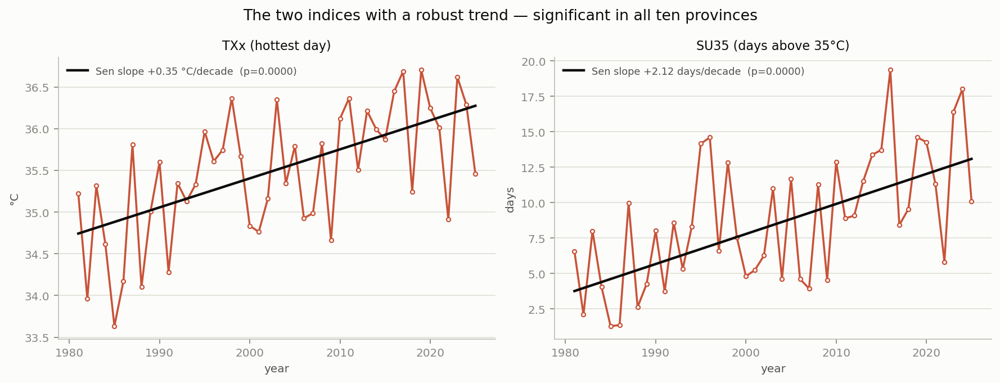
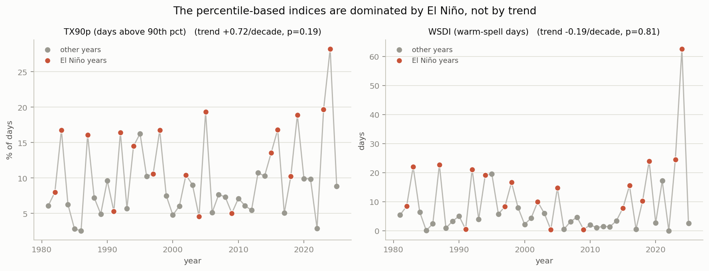

# Zambia's heat extremes: the signal rainfall didn't show

*Companion study to [**zambia-rainfall-extremes**](https://github.com/nephatmwanza/zambia-rainfall-extremes). ERA5 daily maximum
temperature, 1981–2025.*

The rainfall study found that Zambia's rainy season has **reorganised** — more wet days,
weaker downpours, longer dry spells — but with no trend that survives multiple-testing
control. Not one grid cell, for any rainfall index.

Run the identical test on temperature and the answer is completely different.



*Trend per decade in each temperature index, 1981–2025. Red is warming, blue is cooling.
Stippling marks cells significant at p < 0.05. Compare the density of stippling here with
the same figure for rainfall.*

---

## The headline

**The hottest day of the year is rising by +0.35 °C per decade, and days above 35 °C by
+2.1 per decade — significantly, in all ten provinces.**

| Index | Trend per decade | *p* | Provinces significant |
|---|---|---|---|
| **TXx** — hottest day of the year | **+0.35 °C** | < 0.0001 | **10 of 10** |
| **SU35** — days above 35 °C | **+2.12 days** | < 0.0001 | **10 of 10** |
| TXm — mean daily maximum | +0.11 °C | 0.039 | 4 of 10 |
| TX90p — days above the 90th percentile | +0.72 % | 0.19 | 2 of 10 |
| WSDI — warm-spell days | −0.19 days | 0.81 | 0 of 10 |

Across the grid, after false-discovery-rate control at q = 0.10. The middle column is the
**strictly like-for-like** comparison: the same ONDJFM window, the same 45 seasons and the
same cells as the rainfall study, so nothing but the variable differs.

| | ONDJFM season *(directly comparable)* | Full calendar year |
|---|---|---|
| TXx | **969** of ~1,009 cells | 987 |
| SU35 | **669** | 720 |
| TXm | 131 | 327 |
| TX90p | 108 | 125 |
| WSDI | — *(annual only)* | 0 |
| **every rainfall index** | **0** | — |

## Why this makes the rainfall result *more* credible, not less

This is the part worth dwelling on.

A null result always invites the question: *was the test simply too weak, or the pipeline
broken?* Running the same code, over the same country, the same 45 years, the same baseline
and the same corrections — and finding **969 significant cells for temperature against zero
for rainfall, in the very same ONDJFM window** — answers it. The method detects trends perfectly well when they are there.
Zambia's rainfall genuinely has no detectable monotonic trend over this record; its
temperature emphatically does.

That is also the expected physics. Thermodynamic signals emerge from natural variability
much faster than the circulation changes that govern rainfall. It is satisfying to
demonstrate it on one dataset rather than cite it.

## Where the heat is, and where it is growing



*Mean conditions, 1981–2025. The pattern is elevation-driven: the high northern plateau is
coolest, and the low-lying valleys are hottest.*

Zambia's temperature geography is not the north–south rainfall gradient — it follows
elevation. **Northern Province**, on the high plateau, averages just **0.2 days above 35 °C**
a year. **Eastern Province**, containing the Luangwa Valley, averages **22.3**. Western and
Southern, low-lying, sit close behind.



*Every province is warming on both robust indices, and every one significantly.*



*National means with their Theil–Sen slopes. Unlike any rainfall index, the trend here is
large relative to the year-to-year scatter.*

## The two indices that show no trend — and why that is a finding

TX90p and WSDI are the two percentile-based indices, and neither shows a significant trend.
That is not a failure of the analysis; it is a real property of the data.



*Warmest years marked in red are El Niño years.*

**Nine of the ten warmest years by TX90p coincide with an El Niño event.** The two indices
correlate with each other at *r* = 0.89 and spike in the same years — 1983, 1987, 1992, 1998,
2005, 2016, 2019, 2023, 2024.

WSDI is extreme in this respect: its distribution has a **skew of 2.80**, ranging from
**0.02 days to 62.7 days**. Most years see almost no warm spells at all; a handful of El Niño
years see enormous ones. A median-based estimator like Theil–Sen correctly declines to read a
monotonic trend into that, even though the *mean* rises sharply. Reporting "no trend" is the
honest answer, and the ENSO structure is itself the result.

This also explains why SU35 behaves differently despite measuring something similar. It counts
days above a **fixed** 35 °C threshold, so a steadily rising baseline pushes more days over it
every year. TX90p is defined relative to a fixed *percentile*, and is therefore dominated by
whichever years happen to be ENSO-warm.

## What the two analyses say together

Rainfall and temperature point at different kinds of planning problem.

**For rainfall, plan for variability, not for a direction.** The record does not support a
confident claim that Zambia is getting wetter or drier. It does support a redistribution —
rain arriving on more days, in gentler falls, with longer gaps between.

**For heat, plan for a trend.** It is unambiguous, it is present in every province, and it is
largest in exactly the measure that matters for stress on crops and people: the extreme end.

**The two compound.** The growing-season analysis shows the hottest day of the ONDJFM season
rising at **+0.36 °C per decade** and days above 35 °C at **+1.58 per decade** — inside the
same window where dry spells are lengthening. Higher temperatures raise crop water demand at
precisely the moment a longer dry spell would bite hardest. Neither analysis alone shows that;
the pair does.

---

## Method

Identical to the rainfall analysis, which is the point.

| | |
|---|---|
| **Data** | ERA5 daily maximum temperature, 0.25°, 1981–2025 |
| **Baseline** | 1991–2020, matching the rainfall study |
| **Percentile** | 90th, computed **per calendar day** on a 5-day window (ETCCDI) |
| **Trend test** | Mann–Kendall with tie and serial-correlation corrections; Theil–Sen slope |
| **Multiple testing** | Benjamini–Hochberg FDR control |
| **Code** | `scripts/03_compute_heat_indices.sh`, `notebooks/05_heat_trend_analysis.ipynb` |

The statistics live in `src/trends.py`, shared verbatim with the [rainfall analysis](https://github.com/nephatmwanza/zambia-rainfall-extremes)
so the two studies cannot drift apart. It was verified to reproduce that study's published
trends to floating-point precision, and its calibration is asserted on every run.

**Why the calendar-day percentile matters.** Zambia's mean daily maximum runs about 25 °C in
July and 31 °C in October. A single fixed threshold would flag most of the hot season and
almost none of the cool season. The day-of-year threshold used here is 27.1 °C on 1 July and
33.9 °C on 1 October.

**Why WSDI is annual only.** The rainfall script handles seasons crossing 31 December by
re-stamping them onto a synthetic time axis. That trick cannot be used here: the warm-spell
threshold is indexed by day-of-year, so re-stamping would compare each day against the wrong
day's threshold. WSDI is therefore computed on calendar years, which is also the ETCCDI
definition.

## Caveats

- **ERA5 is reanalysis, not observation.** It assimilates observations into a model, and
  station density over Zambia is low. Absolute values should be treated with more caution
  than the trends, which are less sensitive to a constant bias.
- **Tmax only.** Without daily minimum temperature there is no diurnal range, no tropical
  nights, and no night-time heat stress — which matters for health outcomes as much as
  daytime maxima do.
- **45 years**, the same limitation as the rainfall study. It is enough for temperature
  because the signal is larger relative to the noise, not because the record is long.
- ERA5 extends back to 1950, but the pre-1979 back extension is less reliable, and 1981 was
  chosen to match the CHIRPS record exactly so the comparison is like-for-like.

## One correctness note

ERA5 stores latitude **north-to-south**; the province masks run **south-to-north**. Applied
unchecked, every province would have been assigned the wrong half of the country — Northern
Province statistics drawn from southern Zambia — with no error raised and entirely plausible
numbers produced.

`scripts/04_aggregate_provinces.sh` refuses to run when the index and mask grids differ,
which is how this was caught, and `scripts/03` normalises the orientation at source. The fix
is confirmed by the climatology: Northern is coolest and Eastern hottest, which is correct
Zambian geography.

---

## Reproducing this

```bash
conda env create -f environment.yml
conda activate zambia-climate
python -m ipykernel install --user --name zambia-climate \
       --display-name "Python (Zambia Climate)"
```

Steps 1–2 need the raw ERA5 download; **their outputs are committed, so you can go straight
to the notebook.**

| Step | What it does |
|---|---|
| `scripts/01_prepare_data.sh` | clip continental ERA5 to Zambia (CDO) |
| `scripts/02_make_boundaries_and_masks.py` | dissolve districts → provinces, rasterise the mask |
| `scripts/03_compute_heat_indices.sh` | compute the five temperature indices (CDO) |
| `scripts/04_aggregate_provinces.sh` | area-weighted province/national aggregation |
| `notebooks/05_heat_trend_analysis.ipynb` | Mann–Kendall / Theil–Sen, figures, findings |

The notebook needs only numpy/pandas/scipy/matplotlib/netCDF4 — it reads boundaries straight
from GeoJSON with the standard-library `json` module, so **geopandas is not required to
reproduce the analysis** (only to rebuild the mask in step 2, whose output is committed).

### Outputs

| File | Contents |
|---|---|
| `data/processed/zambia_heat_annual.nc` | 5 gridded annual indices × 45 years |
| `data/processed/zambia_heat_ondjfm.nc` | 4 gridded growing-season indices × 45 seasons |
| `data/processed/*_by_province.csv` | tidy province/national series and trends |
| `figures/` | the five figures |

## Related work

| | |
|---|---|
| [**zambia-rainfall-extremes**](https://github.com/nephatmwanza/zambia-rainfall-extremes) | The companion study. CHIRPS rainfall, same period, same pipeline — and the opposite result. |

## Licence

MIT (code). ERA5 data remains under the Copernicus licence-to-use for Copernicus products;
Zambian boundary data under its own terms.
